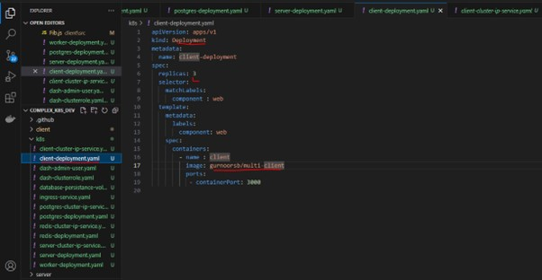
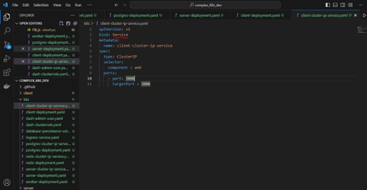
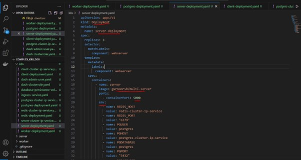
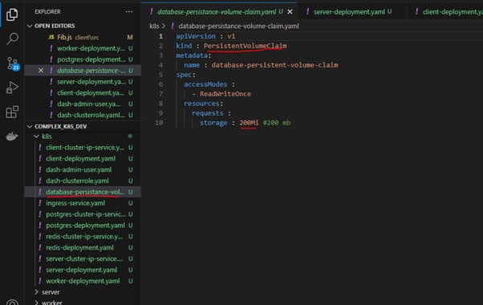
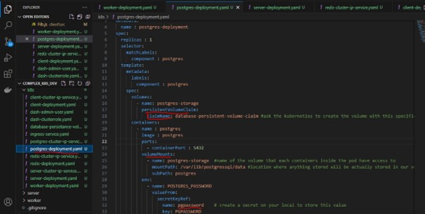
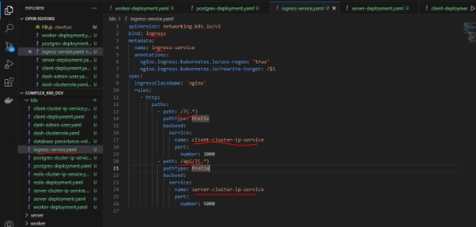
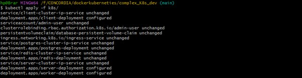
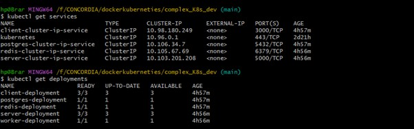
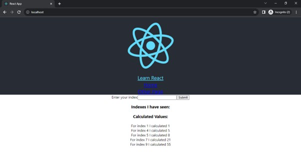

KUBERNETES DEVELOPER VERSION

# Deploying a simple frontend for react app on Kubernetes clusters on local using KUBERNETES using deployment configuration files.
Steps:
-	Make sure we have the images build and pushed to our Dockerhub repository before proceding with deployment files for configuration

-	Create configuration files for Type of Deployment and Service

-	Deployment configuration files will give the details of the pods to be constructed and which images to be used.

-	Service type files will give the information how these deployment pods can be accessed from the other OBJECTS as we will be using type of CLUSTERIP instead of NODEPORT(it is used when we need to expose it to outside world)

#Start
-	Create the Deployment configuration file for the client-deployment.yaml

-	Create the service configuration file for the networking client:

 

-	Create the Deployment configuration file for the server-deployment.yaml
 

Note: here we need to take care of the environment variables that will be used by the postgres and redis

Here we also have secret that need to be saved as an environment variable:
HERE SECRET IN KUBERNETIES IS A KIND OF OBJECT:
we will use the command to store our secret, in our case postgress password:
*kubectl create secret generic pgpassword --from-literal PGPASSWORD=password123

-	same way create the service file for the server

-	Postgress deployment configuration file have the information for postgres setup  with environment variable POSTGRES_PASSWORD,

VOLUME in POSTGRES : we need volume to store the data from the postgres database, that remains even if we delete the container/pod. the kuberneties volume is tied to the pod, and it is external storage, so one container get destroyed other can have access to it, but if pod is destroyed this volume will also get destroyed. 
but in persistence volume, it is not tied to the pod, it is independed of the pod, so If pod get deleted , volume remains:

what is PVC(Persistance volume claim):PVC is basically an advertisement saying this much volume is available, Staticall provisioned volume , is the voume which is already available ahead of time,Dynamically provisioned volume , which is created on request
So, basically PVC is attached to the config pod, then the kuberneties check weather it is statically   provisioned volume or dynamic

 

-	Similarly Service kind file is defiened in order to connect the postgres deployment to the other pods or objects

-	Similarly Redis Confiuration and service files are made.

-	INGRES SERVICE:---

We will use ingress service to expose to the outworld instead of using NODEPORT, We wil create INGRESS CONFIG file and fed to kubectl, which will create inress controller, ingress controller will look into the ingressconfig and make the things happen.

 

Also install Ingress-nginx:
kubectl apply -f https://raw.githubusercontent.com/kubernetes/ingress-nginx/controller-v1.8.2/deploy/static/provider/cloud/deploy.yaml

After having all the services and Deployment ready:
As I have all the files in folder K8s, Run the command using kubectl cli:

 

-	Check your deployment and services files are ready and running:
 

-	Now, we have our containers running, check the http://localhost/ to see the result:
 

